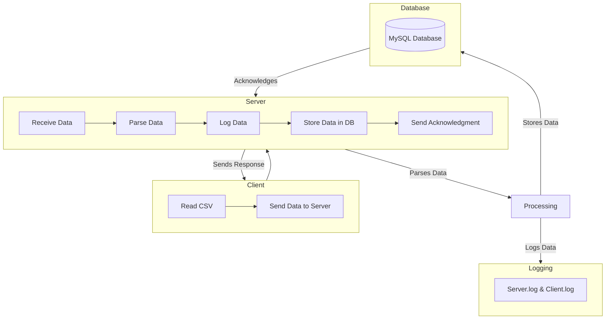

# Data Processing System (DPS)

**Client-Server User Data Processing System**

## Description

This project implements a **Client-Server architecture** where the **client application** reads user data from a CSV file and sends it to the **server application** over TCP. The server processes the received data, logs the activity, stores valid entries in a **MySQL database**, and acknowledges the client with a response.

---

## Architecture Diagram



---

## Outline

### **1️⃣ Setup Database**

To import the schema of the database, run the following command:

```sh
mysql -u root -p < database/init.sql
```

Once the database is set up, make sure to configure the correct database host, name, user, and password inside **server.c**:

```c
#define DB_HOST "localhost"
#define DB_USER "random"
#define DB_NAME "user_data"
#define DB_PASS "Pass@123"
```

Ensure the **MySQL user has proper permissions** to access the database.

### **2️⃣ Install MySQL Library**

You must install the MySQL development libraries required to compile the server application.

On Debian-based systems (Ubuntu, etc.), run:

```sh
sudo apt-get install libmysqlclient-dev
```

On RHEL-based systems (CentOS, Fedora):

```sh
sudo yum install mysql-devel
```

### **3️⃣ Run the Server**

Open a terminal and execute the following script to start the server:

```sh
server_app/run.sh
```

To check server logs in real time, use:

```sh
tail -f server_app/logs/server.log
```

### **4️⃣ Run the Client**

Open another terminal and execute the following script to start the client:

```sh
client_app/run.sh
```

To check client logs in real time, use:

```sh
tail -f client_app/logs/client.log
```

---

## **Features**

- **Client reads data from CSV** and sends it to the server.
- **Server receives, processes, logs, and stores data** in the MySQL database.
- **Logs all server and client activity** for debugging and tracking.
- **Acknowledges client after processing each record**.

---

## **Project Structure**

```sh
.
├── client_app
│   ├── client
│   ├── client.c
│   ├── logs
│   │   └── client.log
│   ├── run.sh
│   └── users.csv
├── database
│   └── init.sql
├── readme.md
└── server_app
    ├── db_handler.h
    ├── logs
    │   └── server.log
    ├── Makefile
    ├── run.sh
    ├── server
    ├── server.c
    ├── server.mermaid
    └── server.o
```

---

## **Contributing**

If you find a bug or want to add improvements, feel free to submit a **pull request**!

🚀 **Thank you!**

